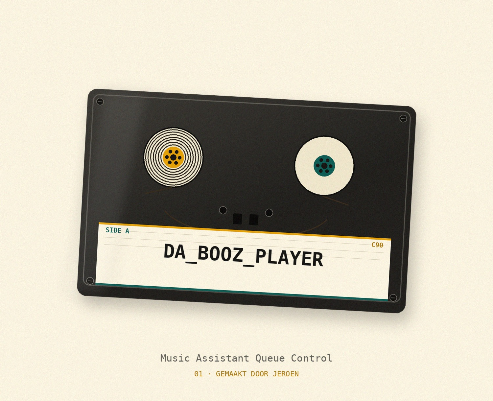
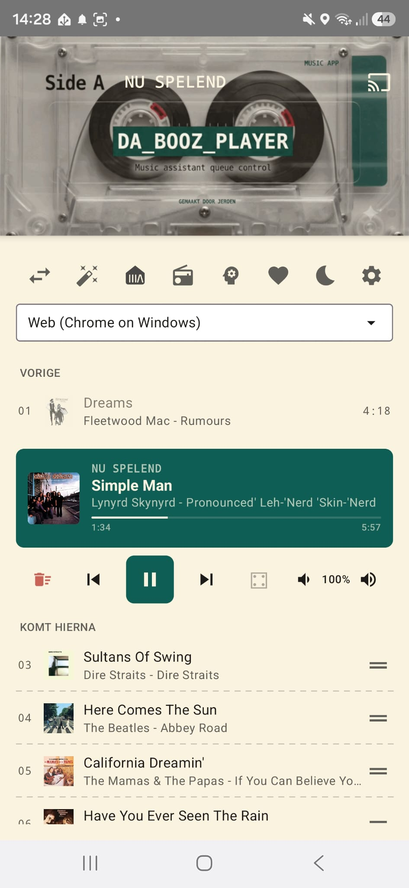

# Da Booz Player — Native Music Assistant App

Een moderne, native Android-app voor het bedienen van je **Music Assistant** (MA) server. Deze app is ontworpen om een snelle en betrouwbare interface te bieden, onafhankelijk van de Home Assistant Ingress-proxy, met slimme functies voor thuisgebruik.

  

Boven in het scherm zit een cassettebandje: de spoeltjes **draaien zolang er muziek speelt** en **staan stil zodra de muziek pauzeert of stopt**, zodat je in één oogopslag ziet of er iets klinkt.

## Nieuw: AI Radio DJ (Beta) 🎙️
De app bevat nu een experimentele **AI Radio DJ** die je playlists aan elkaar praat:
- **ElevenLabs Integratie**: Gebruikt de hoogwaardige stemmen van ElevenLabs via Home Assistant.
- **Aanpasbare Stijl**: Kies uit verschillende stijlen zoals 'Enthousiast', 'Grappig' of 'Zakelijk'.
- **Vrije Instructies**: Geef de DJ specifieke opdrachten mee (bijv. "Vertel iets over het weer" of "Maak een grapje over de band").

## Belangrijkste Functionaliteiten

### 1. Slimme Locatie-beveiliging (Geofencing)
De app is zich bewust van zijn locatie om de interface schoon en relevant te houden:
- **Dynamische Filtering**: Kies in de instellingen welke speakers als "lokaal" worden beschouwd. Deze worden automatisch verborgen als je meer dan **150 meter** van huis bent.
- **Configureerbare Thuislocatie**: Pin je eigen thuislocatie eenvoudig via het instellingenscherm.
- **Afstandsweergave**: Toont de actuele afstand tot huis wanneer je buiten het bereik bent.

### 2. Geavanceerd Volume-beheer & Aliassen
- **Hardware Knoppen**: De volumeknoppen van je telefoon bedienen direct de actieve speler. In de instellingen vink je eenvoudig aan voor welke spelers dit actief moet zijn.
- **Speler Aliassen**: Geef je speakers eigen "roepnamen" (bijv. "Yamaha Living" -> "Woonkamer") die overal in de app worden gebruikt.
- **Slimme Spelerkeuze**: De dropdown sorteert spelers die nu spelen bovenaan (meest recent gestart eerst), gevolgd door spelers met een geladen wachtrij, en de rest alfabetisch. Bij het eerste opstarten kiest de app om dezelfde reden ook zo'n speler als standaard, in plaats van gewoon de alfabetisch eerste.
- **Spelers verbergen**: Vink in Instellingen onder "Spelers in keuzelijst" spelers uit die je nooit gebruikt; ze verdwijnen uit de dropdown (de actief geselecteerde speler blijft altijd zichtbaar).

### 3. Player Experience
- **Compact & Elegant**: De interface is geoptimaliseerd voor gebruiksgemak met een slanke "Nu Spelend" balk en compacte dropdowns.
- **Music Wizard**: Een handige stapsgewijze hulp om snel een speler te kiezen en je favoriete muziek te starten.
- **Wachtrijbeheer**: Bekijk tot wel 50 nummers in de wachtrij, skip, shuffle (geanimeerde dobbelsteen) of wis de lijst.
- **Wachtrij slepen**: Elk "Komt hierna"-nummer heeft een sleep-handle in de lijst zelf; bij loslaten volgt één `player_queues/move_item` met de netto verschuiving.
- **Muziek Verhuizen (Transfer)**: Verplaats je actuele wachtrij met één klik naar een andere speler.
- **Casten** 📡: Een cast-knop rechtsboven opent een lijst met apparaten; kies er één en de speler + muziek verhuist ernaartoe (met auto-play). Chromecast-/Google Cast-/Nest-apparaten staan bovenaan met een cast-icoon.
- **Releasejaar**: Naast de titel van het nu spelende nummer verschijnt, waar bekend, het releasejaar — uit Music Assistant's eigen metadata, of anders (bijv. bij radio) via een gefilterde iTunes-zoekopdracht met caching per zoekterm.
- **Vloeiende voortgangsbalk**: De positie loopt lokaal door tussen de serverpolls in, zodat de balk soepel meebeweegt in plaats van te verspringen.
- **Slaaptimer** 🌙: Zet via de maan-knop een timer op 15/30/45/60/90 minuten. Een chip toont de resterende tijd; daarna pauzeert de muziek automatisch.
- **Lockscreen- & bluetooth-bediening**: Een `MediaSession` toont het nu spelende nummer met hoes in de notificatiebalk en op het lockscreen. Play/pauze/vorige/volgende werken daar en via bluetooth-, koptelefoon- en autoknoppen; de commando's gaan naar Music Assistant en de status komt terug in de notificatie.

### 4. Radio 📻
- **Nu spelend nummer**: Bij een radiostream toont de app niet alleen de zendernaam, maar ook de live artiest, songtitel en (indien meegestuurd) het album — net als in Music Assistant zelf. Data komt uit `streamdetails.stream_metadata`, met de ICY `stream_title` ("Artiest - Titel") als terugval.
- **Wisselende hoes**: Standaard de albumhoes van het huidige nummer (met iTunes-terugval als de stream er geen meelevert); elke ~30 seconden verschijnt ~5 seconden lang het zenderlogo.
- **Eerder op deze zender**: Een lijstje met de laatste ~50 nummers die op de zender voorbijkwamen, inclusief het nummer dat nu speelt. Blijft bewaard tussen app-herstarts en wist zichzelf pas bij een echte zenderwissel (niet tijdens het tijdelijk onderbreken van de stream om een geschiedenisnummer af te spelen). Tik op een nummer en de app zoekt het op in Music Assistant, speelt het nu af op de radio-speler en zet de zender er direct achteraan zodat de stream vanzelf hervat. Via het hartje sla je de geschiedenis (inclusief het huidige nummer) op als favoriete afspeellijst, onder de naam van de zender zoals die nu op het scherm staat.

### 5. Techniek & Connectiviteit
- **Rechtstreekse Verbinding**: Commando's gaan via JSON-RPC (`POST /api`) direct naar de Music Assistant server; HA-services via de REST API.
- **Push i.p.v. pollen**: Een WebSocket (`wss://<server>/ws`) authenticeert met een `auth`-commando en levert daarna live events (`player_updated`, `queue_updated`, …). De app ververst binnen ~250 ms op zo'n event i.p.v. elke paar seconden te pollen. Er blijft een trage heartbeat (30 s) als vangnet; valt de socket weg, dan schakelt de app terug naar snel pollen (3 s) en verbindt automatisch opnieuw met oplopende backoff.
- **Portrait Only**: De app blijft altijd in staande stand voor een consistente ervaring.
- **Sessie Management**: Houdt je Music Assistant-sessie op de achtergrond actief.
- **Artwork-cache**: iTunes-hoeszoekopdrachten worden per zoekterm onthouden om onnodig netwerkverkeer te voorkomen.

## Installatie & Configuratie voor Ontwikkelaars

1. **Android Studio**: Open dit project in Android Studio (Ladybug of nieuwer).
2. **Command line (optioneel)**: De Gradle-wrapper zit in de repo, dus `./gradlew assembleDebug` (of `gradlew.bat` op Windows) bouwt een debug-APK zonder Android Studio.
3. **Server Instellen**: Bij de eerste start vraagt de app om de URL van je Music Assistant server en een HA Access Token.
4. **Locatie**: Geef toestemming voor locatiegebruik voor de slimme filtering.

---
*Ontwikkeld voor eigen gebruik door Jeroen van Sonsbeek (jeroenvansonsbeek@gmail.com).*
